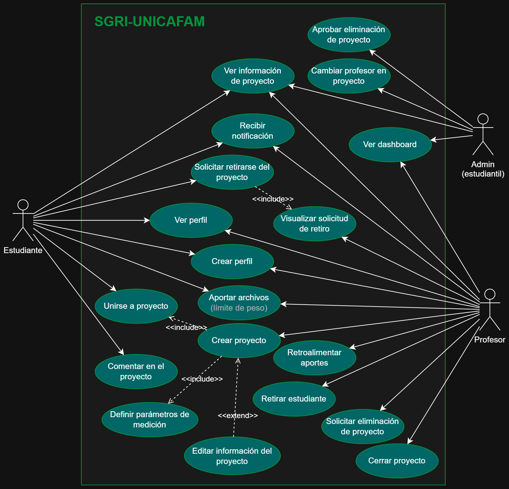

# SGRI - Sistema de Gestión de la Investigación Institucional
## Proyecto para la Fundación Universitaria Cafam.
Open Source para el conocimiento.

## Diagramas
### Casos de uso

Casos de uso en el sistema SGRI por cada uno de los actores: **estudiante**, **profesor** y **administración estudiantil**.

waos
