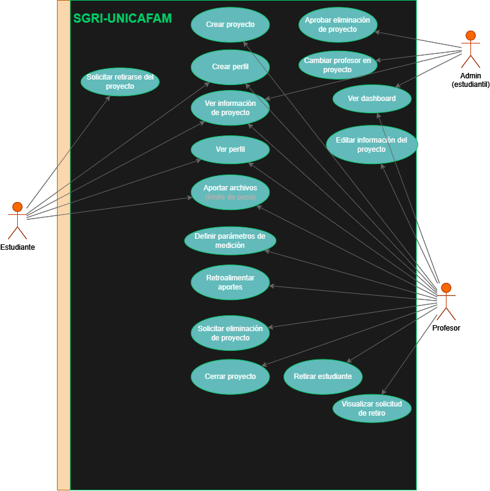

# SGRI - Sistema de Gestión de la Investigación Institucional
## Proyecto para la Fundación Universitaria Cafam.
*Open Source para el conocimiento.*

---

## 🚀 SGRI - Campus Académico (React)

Una aplicación web moderna y premium construida con React y Vite, diseñada para la gestión académica y de proyectos con una estética "Liquid Glass".

### Características principales

- **Interfaz Premium**: Diseño basado en Glassmorphism con animaciones fluidas y soporte para múltiples temas (Oscuro, Claro, Dim, Eye Care).
- **Gestión de Proyectos**: Tablero Kanban interactivo para el seguimiento de tareas.
- **Gestor de Archivos**: Sistema con control de versiones local para mayor seguridad.
- **Optimización Móvil**: 100% responsive, diseñado para ofrecer una experiencia nativa tanto en escritorio como en dispositivos móviles (Android/iOS).
- **Navegación Inteligente**: Command Palette estilo Spotlight para una navegación rápida.

## 🛠️ Tecnologías

- **Core**: React 19 + Vite
- **Estilos**: Vanilla CSS con variables dinámicas y efectos de desenfoque.
- **Iconos**: Lucide Icons (SVG).
- **Estado**: React Context API con `useReducer`.

## 📦 Instalación y Uso

1. Clona el repositorio:
   ```bash
   git clone https://github.com/ochuxx/project-sgri.git
   ```

2. Instala las dependencias:
   ```bash
   npm install
   ```

3. Inicia el servidor de desarrollo:
   ```bash
   npm run dev
   ```

## 📊 Diagramas y Documentación

### Casos de uso
Casos de uso en el sistema SGRI por cada uno de los actores: **estudiante**, **profesor** y **administración estudiantil**.



### Documentación técnica adicional
- [Documentación Técnica](./DOCUMENTACION_TECNICA.md)
- [Resumen Detallado](./RESUMEN_DETALLADO.md)

---
*Proyecto generado como parte de la modernización del Campus Académico (SGRI) - 2026.*
